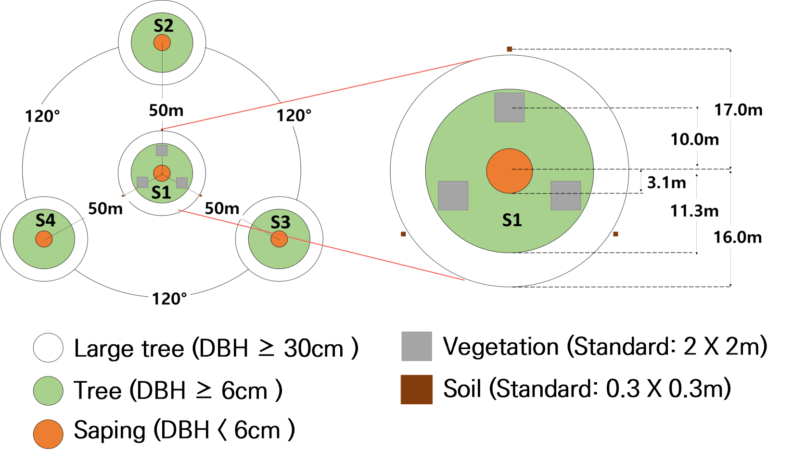

[](https://github.com/SYOUNG9836/rNFI/actions/workflows/R-CMD-check.yaml)
[](https://ci.appveyor.com/project/sckott/rNFI/branch/main/)
[](https://app.codecov.io/gh/SYOUNG9836/rNFI?branch=main)
[](https://cran.r-project.org/package=rNFI)
[](https://github.com/r-hub/cranlogs.app)


# rNFI: Analysis of National Forest Inventory DB

## Overview

Understanding the current status of forest resources is essential for monitoring changes in the forest ecosystem and producing related statistics. National Forest Inventory (NFI) surveys about 4,000 sample plots nationwide every five years and records 70 items, including forest surveys, forest resource surveys, and forest vegetation surveys. Many researchers are using NFI as primary data for research when estimating biomass or analyzing the importance value of each species in the time and space suitable for the research purpose. However, the accumulation of various forest survey data across the country limits the use of vast data. Therefore, this study developed an algorithm that efficiently processes vast amounts of NFI data in time and space using the statistical analysis software R (version 4.1.1). The developed algorithm first reconstructs NFI in time and space according to the researcher's purpose and performs integrity verification to maintain data quality. Subsequently, summary statistics, biodiversity, importance value, and biomass are analyzed using the verified data. Finally, visualizing the analysis results allows spatio-temporal access to forest ecosystem changes. 


Distribution of National Forest Inventory sample plots (left) and sampling design of the National Forest Inventory (right) (Korea Forest Research Institute, 2011)



Plot design of National Forest Inventory (Korea Forest Research Institute, 2011)

## Installation

``` r
# The easiest way to get rNFI is to install just rNFI:
install.packages("rNFI")

# Or the development version from GitHub:
remotes::install_github("SYOUNG9836/rNFI")
```

